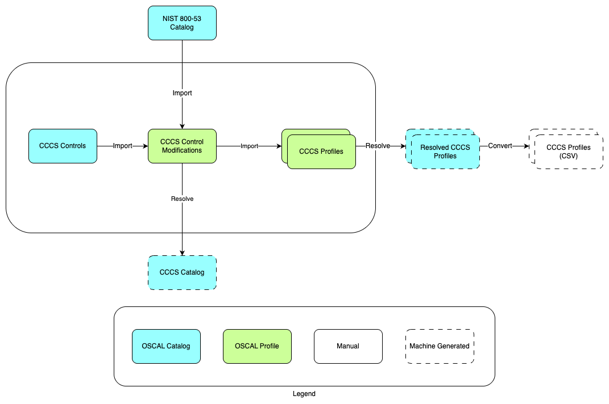

# CCCS OSCAL Samples

This repo includes sample implementations of security control profiles from the [Canadian Centre for Cyber Security](https://cyber.gc.ca/en) (CCCS), expressed using the [Open Security Controls Assessment Language](https://pages.nist.gov/OSCAL/) (OSCAL).

For an introduction to key OSCAL concepts, please see the [documentation](https://pages.nist.gov/OSCAL/resources/concepts/terminology/).

## OSCAL files

CCCS' security guidance has been expressed in the following OSCAL files:

- `cccs-catalog.json` — This OSCAL catalog describes security controls that are not part of NIST 800-53.
- `cccs-mods-profile.json` — This OSCAL profile imports controls from the NIST 800-53 catalog and makes CCCS-specific modifications.
- `cccs-medium-profile.json` — This OSCAL profile imports controls from the `cccs-mods` profile and sets parameters in accordance with the CCCS Medium security control profile.
- `cccs-pbhva-profile.json` — This OSCAL profile imports controls from the `cccs-mods` profile and sets parameters in accordance with the CCCS Protected B High Value Assets (PBHVA) security control overlay.

This repo also incorporates NIST's [`oscal-content`](https://github.com/usnistgov/oscal-content/) repo as a submodule, which includes the NIST 800-53 catalog in OSCAL form.

## Profile resolution and CSV conversion

The `scripts` folder includes a shell script, `resolve.sh`, which completes the following steps for each of the included profiles:

1. Calls `oscal-cli` to resovle the profile to an OSCAL catalog (see NIST's [documentation](https://pages.nist.gov/OSCAL/resources/concepts/processing/profile-resolution/) for more information on profile resolution).
1. Calls `oscal-cli` to validate the resolved catalog.
1. Calls `catalog-to-csv.py`, which converts the catalog into a human-readable CSV format, including mapping specified parameter values into control statements.

The outputs generated by `resolve.sh` are included in the repo, and are named as follows:

- `cccs-{profile}-resolved.json`
- `cccs-{profile}-resolved.csv`

## Use

1. Install prerequisites as required for your OS:
    1. Python 3
    1. Java Runtime Environment
    1. `oscal-cli`: https://github.com/metaschema-framework/oscal-cli
1. Clone this repo locally, using `git clone` with the `--recurse-submodules` flag.
1. Make changes to the files listed under __OSCAL Files__ above.
1. From the root directory of the repo, run `scripts/resolve.sh`, which will generate and overwrite the `*-resolved.json` and `*-resolved.csv` files.

## Known issues

1. Controls from `cccs-catalog.json` are not currently imported by `cccs-mods-profile.json`, due to a suspected bug in `oscal-cli`. 
    - Open issue: https://github.com/metaschema-framework/oscal-cli/issues/60.
