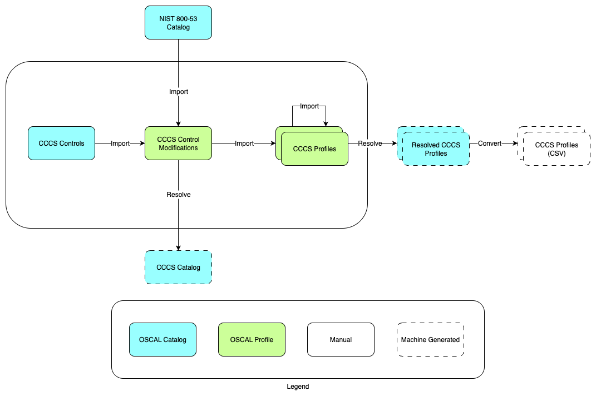

# CCCS OSCAL Samples

This repo includes sample implementations of security control profiles from the [Canadian Centre for Cyber Security](https://cyber.gc.ca/en) (CCCS), expressed using the [Open Security Controls Assessment Language](https://pages.nist.gov/OSCAL/) (OSCAL).

For an introduction to key OSCAL concepts, please see the [documentation](https://pages.nist.gov/OSCAL/resources/concepts/terminology/).

> [!IMPORTANT]  
> These representations are not officical CCCS guidance. For further information, visit https://cyber.gc.ca/en or contact CCCS at contact@cyber.gc.ca.

## OSCAL files

The repo is structured into the following folders:

- `imports` - OSCAL resources imported by profiles, including a catalog containing unique CCCS security controls and the `cccs-mods` profile specifies which CCCS modifications to existing NIST 800-53 controls.
- `profiles` - OSCAL profiles reflecting CCCS security requirements.
- `scripts` - Scripts to process the OSCAL files.
- `diagrams` - The architecture diagram above.

The repo also incorporates NIST's [`oscal-content`](https://github.com/usnistgov/oscal-content/) repo as a submodule in the `imports` folder, which includes the NIST 800-53 catalog in OSCAL form.

## Profile resolution and CSV conversion

The shell script at `scripts/resolve.sh` calls `oscal-cli` to validate the `cccs-control-catalog` catalog file, then completes the following steps for each of the included profiles:

1. Calls `oscal-cli` to resovle the profile to an OSCAL catalog (see NIST's [documentation](https://pages.nist.gov/OSCAL/resources/concepts/processing/profile-resolution/) for more information on profile resolution).
1. Calls `oscal-cli` to validate the resolved catalog.
1. Calls `catalog-to-csv.py`, which converts the catalog into a human-readable CSV format, including mapping specified parameter values into control statements.

The outputs generated by `resolve.sh` are included in the respective profile folders, and are named as follows:

- `cccs-{profile}-resolved.json`
- `cccs-{profile}-resolved.csv`

## Use

1. Install prerequisites as required for your OS:
    1. Python 3
    1. Java Runtime Environment
    1. `oscal-cli`: https://github.com/metaschema-framework/oscal-cli
1. Clone this repo locally, using `git clone` with the `--recurse-submodules` flag.
1. Make any required changes to the files listed under __OSCAL Files__ above.
1. From the root directory of the repo, run `scripts/resolve.sh`, which will generate and overwrite the `*-resolved.json` and `*-resolved.csv` files.

## Security

See [CONTRIBUTING](CONTRIBUTING.md#security-issue-notifications) for more information.

## License

This library is licensed under the MIT-0 License. See the LICENSE file.
